# CartPractice

**연관관계 매핑 연습을 위해, 장바구니를 구현해보았습니다.**

구현 도중, 아래의 문제를 마주하고 기록하였습니다.

## [장바구니]연관관계 매핑 관련 문제
**이를 통해 모르는 것이 무엇인지 제대로 알았다.**

1. 트랜잭션
2. 연관관계 매핑과 영속성 전이의 작동 방식이 아직 잘 와닿지 않는다.
3. 연관관계 매핑을 어떻게 구성해줘야 좋을지 잘 모르겠다.

### Member에 Cart가 할당되고, Cart가 잘 저장되었지만, Cart에 Member가 할당되지 않았다.

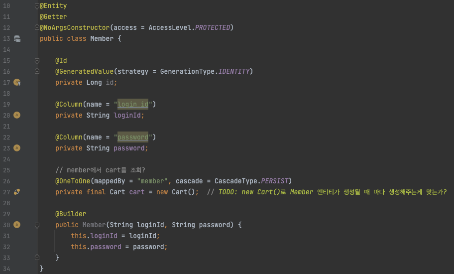 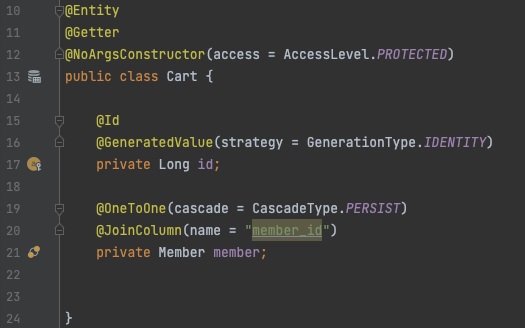

위와 같이 엔티티를 구성하였다.

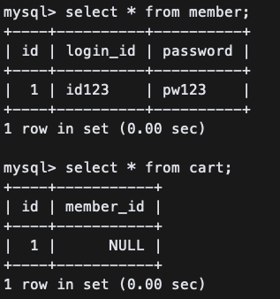
- 테스트 코드를 돌린 결과
    - 맨 처음에는, Member에 cascade를 설정해주지 않아 오류가 났었다.
        - 이는 멤버에 `cascade=PERSIST`를 추가해주어 해결했다. 멤버를 저장할 때 cart도 저장되도록 했다.
    - 멤버에 Cart가 제대로 추가되었다.

      *`assertThat*(member.getCart()).isNotNull();` 으로 검증

    - Cart도 리포지토리에 제대로 추가되었다.

      *`assertThat*(cartRepository.findAll().size()).isEqualTo(1);`

⇒ 하지만, Cart에 Member가 할당되지 않았다.

아무래도, 멤버에 new Cart()만 해주었을 뿐, Cart에는 멤버를 지정해주지 않아서 발생한 것 같았다.

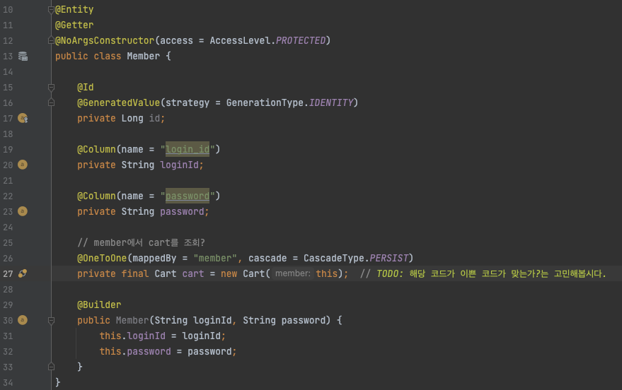

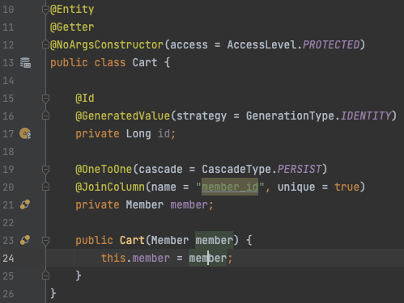

Cart에 생성자를 추가해주고, 멤버 객체에서 `this`를 이용하여 지정해주었다.

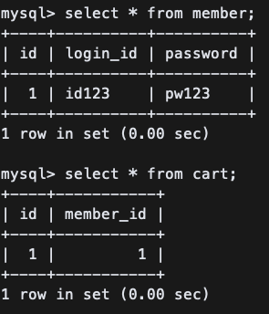

그 결과, member가 저장될 때, Cart가 생성되고, 해당 멤버가 생성된 Cart에 잘 지정이 되었다.

또하나의 문제 사항이 발생했다.

나는 Member Entity를 삭제하면 Cart, 그리고 CartItem이 함께 삭제되기를 원했다. (아이템은 삭제되어선 안된다.)

그런데, Foreign key 지정으로 인해 삭제가 안된다는 에러가 계속하여 발생하였다.

→ 이것은 영속성 전이로 해결하였음.
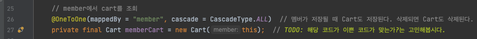
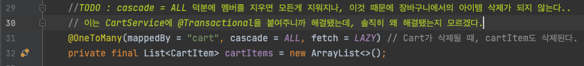

이후에, 전체 테스트 코드를 돌리면 항상 한개가 실패하고 아래의 메세지가 떴다.

`Cannot delete or update a parent row: a foreign key constraint fails`

분명 각각 테스트 할 때는 잘되는데, 전체 테스트만 돌리면 이랬다.

분명 테스트가 서로 영향을 주는 건데, 이유를 알 수가 없었다.

→ 저장 테스트에 `@Transactional` 을 입력해주니까 해결되었다 (공부해야함)

⇒ 회원 저장 테스트와 회원 삭제 테스트가 서로 충돌이 발생한 이유는, 트랜잭션이 제대로 분리가 되지 않았기 때문이었던 것 같다.

⇒ 트랜잭션에 대한 공부가 더 필요한 것 같다.

또, 장바구니에서의 아이템 삭제 로직을 짰는데, 삭제가 전혀 되지 않았다

https://cantcoding.tistory.com/75

위 글을 보면, 회원을 삭제할 때 모든걸 삭제되게 하려고 짰던 아래의 코드 때문이었던 것 같다.

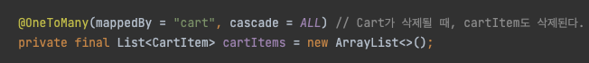

cascade = ALL을 제거해주면 카트에 담긴 아이템 삭제가 잘 된다.

**하지만, 회원 삭제 로직은 제대로 작동되지 않는다.**

여러가지 시도를 해보았지만, 나의 에러는 더 큰 에러를 낳았다…. 그냥 다시 cascade = ALL로 두고, 아래와 같이 삭제 로직에 `@Transactional`을 붙여주었다. (진짜 그냥 붙였음. 아직 왜 해결됐는지 모릅니다… 공부하자 공부 ㅠ)

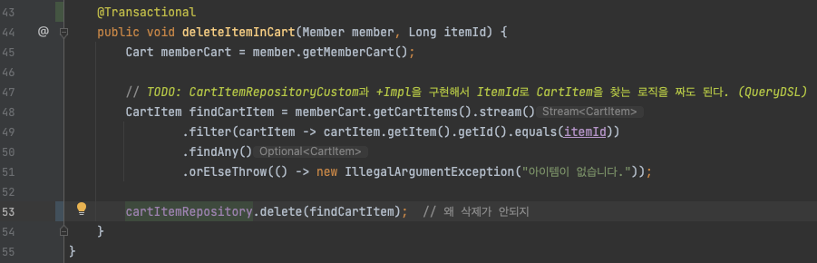

그랬더니 테스트가 전부 해결되었다.

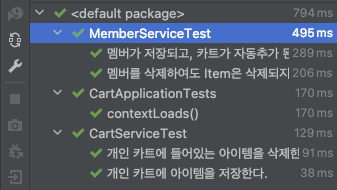

이를 통해, 내가 진짜 제대로 모르는 부분을 알았다.

1. DB와 Spring이 어떤식으로 일을 함께 진행하는지 알지 못한다.
2. @Transactional 의 원리를 아직도 모르겠다. 이는 트랜잭션 자체를 공부해봐야 할 것 같다.
3. 영속성 전이를 설정해줌으로써, 삭제가 연쇄적으로 발생하는 기작은 이해하였다.
   하지만, 영속성 전이 때문에 객체가 삭제되지 않는 것은 왜 때문인지 자세히는 모르겠다. 아래의 사실 정도만 알아갈 수 있었다. → 더 공부가 필요하단 의미
    1. 일단, 영속성 전이를 사용하고자 하는 두 객체는 **“라이프 사이클"**이 같아야 한다.
    2. 즉, CartItem은 삭제되어도, Cart는 삭제되지 않는다. 이 둘은 라이프 사이클이 다르기 때문이다. CartItem은 수시로 사라질 수 있지만, Cart는 회원이 사라지지 않는 이상 사라지지 않기 때문이다.
    3. **그러면, 라이프 사이클이 같은 Member - Cart - CartItem과, 라이프 사이클이 다른 Cart - CartItem은 어떻게 관리해야 할까?
       Cart와 CartItem은 Member와는 라이프사이클이 같기 때문에, 멤버가 사라지면 둘 다 사라져야 한다. 그래서 아래와 같이 cartItems에 cascade = ALL을 반드시 넣어줘야한다.**
   
       

    4. **반면, Cart와 CartItem은 서로 라이프사이클이 다르기 때문에, cascade = ALL이 있으면 안된다. 딜레마다. 어떻게 구성해야 할 지 잘 생각을 해봐야 할 듯 하다…^^…. 일단은 공부부터 하자. 모든 것은 DB에 대한 기초 지식이 매우 부족하기 때문이다..**

### 이게 왜 될까??를 파헤쳐보자. 알 때 까지.

문제는 아래와 같은 이유로 발생했을 것이다.

- 커밋이 이루어지지 않았거나
- 같은 세션이 아니었거나

결국 테스트코드에선 삭제 요청을 해서 서비스 단에서 삭제는 했지만, 삭제가 반영이 되지 않은 것 보니 DB에 삭제 쿼리가 날아가지 않은 것이다(실제로 확인해도 날아가지 않음)

그렇다면 트랜잭션의 커밋이 발생하지 않았거나

모종의 이유로 롤백이 되었다거나

테스트 코드와 서비스단이 서로 다른 세션에서 data를 처리한 것 같다. (즉, 다른 커넥션이다.)

즉, 둘은 같은 커넥션을 사용해야 한다. (그래야 같은 트랜잭션 내에서 업무를 수행하므로)

그리고 주의할 점은트랜잭션을 걸어주지 않으면 save, find 등 쿼리가 날아가는 메서드는 개별 실행이 되어, 커넥션이 전부 다르다.

그래서 @Transactional을 서비스단의 메서드에 달아줌으로써 서로를 연결해 주게 된 것 같은데, 이는 해당 애노테이션에 대한 공부가 더 필요할 듯 하다.

여기서 체크해야 할 포인트 :
1. @Transactional을 사용하기 전에 Test code와 CartService가 다른 커넥션을 사용하는가?
2. Test Code와 CartService가 같은 트랜잭션, 즉 같은 커넥션 내에서 구동이 되는가?
3. Test Code를 독립적으로 짜는 데 완전히 실패했다. 원인은 무엇인지 파악해보고 해결 방안을 마련해보자.

### 새로운 문제...
7/26(화) 어제까지 분명히 @Transactional 없이는 성공조차 하지 않던 테스트 코드가,
오늘 트랜잭션 구동방식좀 공부하느라 애노테이션을 지우고 다시 해봤는데 잘된다. 대체 왜될까?........
이쯤되면 정말 세밀하게 다시 설계해서 다시 구현해봐야 할 것 같다...